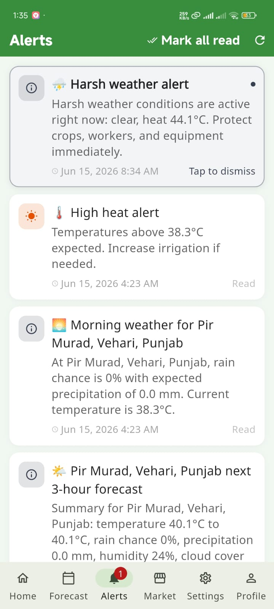
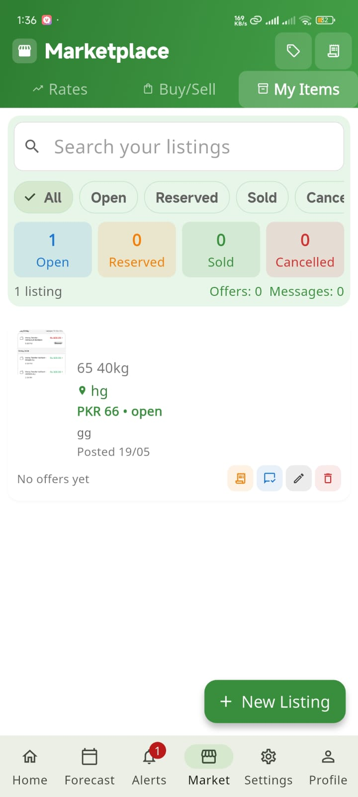
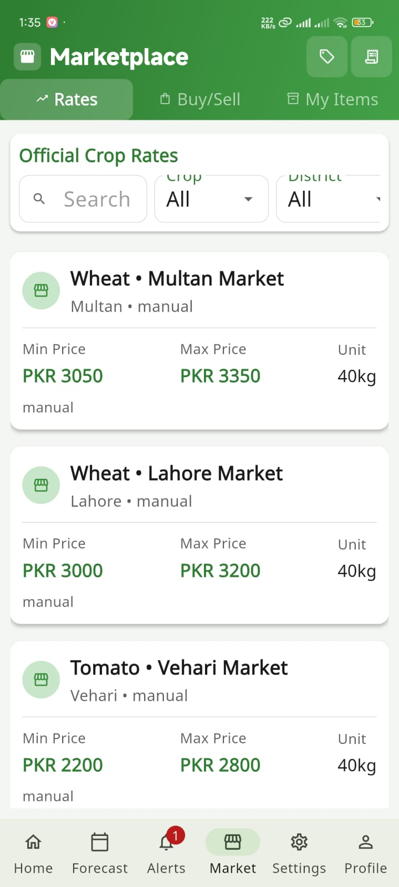
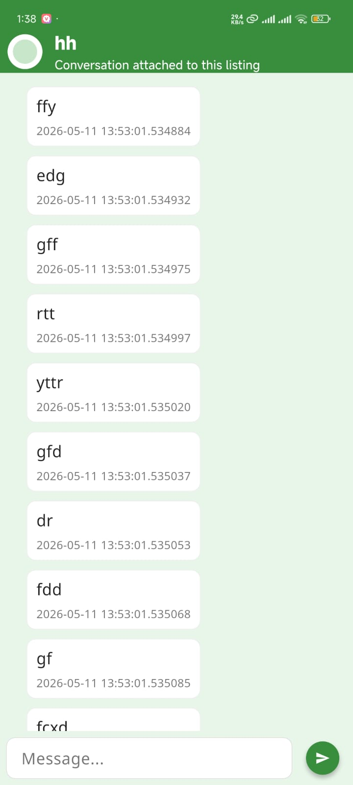
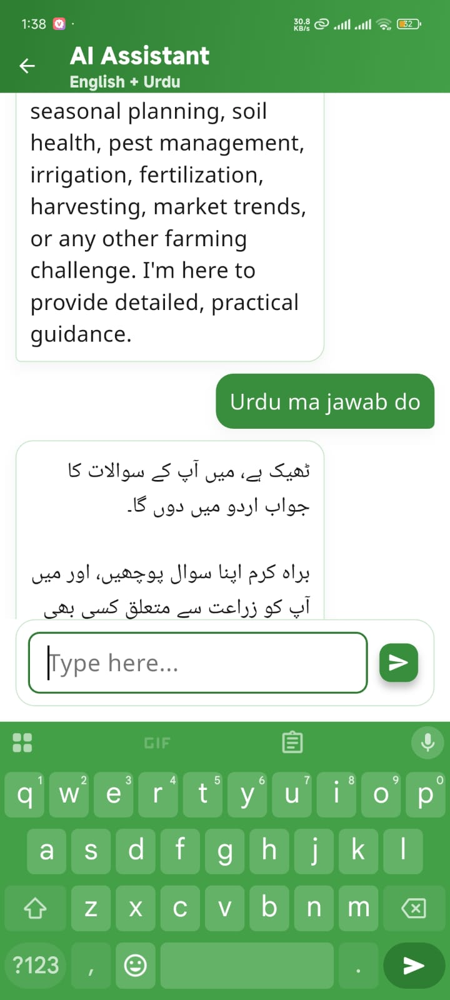
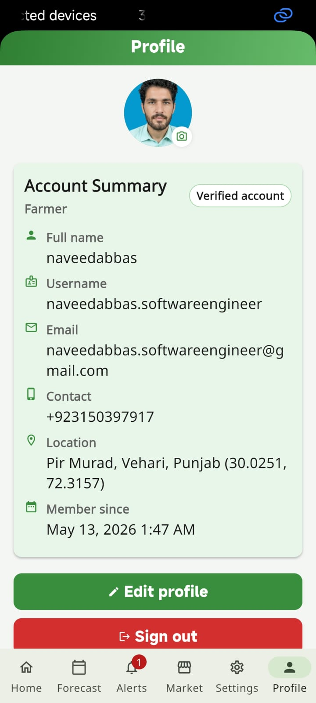
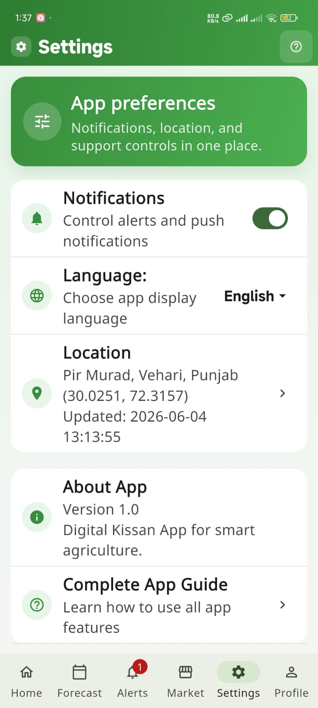

# Digital Kissan App

A comprehensive agricultural mobile application designed to empower farmers with real-time market information, weather forecasts, communication tools, and a digital marketplace. Built with Flutter [...]

**Digital Kissan** (Digital Farmer) is a mobile platform connecting farmers, traders, and agricultural professionals with tools for market access, weather intelligence, and community support.

---

## 🌾 Project Overview

**Digital Kissan** is a Flutter-based mobile application that provides:
- **Real-time weather forecasts** for agricultural planning
- **Market rate monitoring** for agricultural commodities
- **Digital marketplace** for buying and selling produce
- **AI-powered chatbot** for farming guidance
- **Direct messaging** between buyers and sellers
- **Alert system** for weather and price changes
- **Multi-language support** (English & Urdu)

**Quick Facts:**
- **Language Composition:** Dart (84.6%), JavaScript (15.3%), Other (0.1%)
- **Dart SDK constraint:** `^3.7.2`
- **Android Java target:** Java 11
- **Platform:** Flutter (iOS & Android)

---

## 🎨 App Features & Screenshots

### 1. **Splash Screen**


The welcoming splash screen that greets users when they launch the application, featuring the Digital Kissan branding and loading animation.

---

### 2. **Dashboard Screen**


The main hub of the application where users can quickly access:
- Current weather conditions and quick weather overview
- Recent market rates for agricultural commodities
- Shortcuts to key features (marketplace, alerts, profile)
- User's location and relevant local information

---

### 3. **Weather & Forecasts**

#### **7-Day Forecast**


Provides an extended weather outlook showing:
- Daily temperature ranges
- Precipitation probability
- Wind speed and direction
- Weather conditions for the next 7 days

#### **Detailed Forecast**


Comprehensive hourly and daily weather information including:
- Temperature trends
- Humidity levels
- UV index
- Visibility and atmospheric pressure

---

### 4. **Alerts System**

To make the Alerts screenshots show as three smaller screens side-by-side for a clearer view, I've replaced the single large images with a small responsive gallery that displays up to three images in a row. This keeps images clear while reducing their visual footprint.

<div style="display:flex;gap:8px;align-items:flex-start;flex-wrap:wrap">
  
  
  
</div>


Quick access button to weather and market alerts from the main interface.


Centralized alert management displaying:
- Critical weather warnings (frost, storms, extreme temperatures)
- Market price alerts for selected commodities
- Agricultural advisory notifications
- Customizable alert preferences

---

### 5. **Marketplace Features**

#### **Marketplace Overview**


The digital marketplace for buying and selling agricultural products:
- Browse available listings from farmers and traders
- Filter by commodity type, location, and price range
- Real-time inventory updates
- Seller ratings and reviews

#### **Buy & Sell Interface**


Dual marketplace view allowing users to:
- Post new listings for sale
- Browse and purchase from others
- Manage active listings
- Track transaction history

#### **Listing Details**


Detailed product information including:
- Product images and specifications
- Quantity available
- Price and discounts
- Seller information and contact details
- Location on map
- Customer reviews

#### **Edit Listing**


Interface for updating product listings:
- Modify price and quantity
- Update product description
- Change product images
- Adjust delivery terms

---

### 6. **Market Rates & Pricing**


Real-time commodity price information:
- Current market rates for major agricultural products
- Price trends and historical data
- Regional price comparisons
- Price alerts for tracked commodities
- Data sourced from official government and market sources

---

### 7. **Communication & Support**

#### **Chat**


Direct messaging between buyers and sellers:
- Real-time chat with transaction partners
- Message history and search
- Image and file sharing
- Transaction-linked conversations

#### **AI Chatbot Assistant**


Intelligent agricultural guidance powered by AI:
- Answer farming questions (crop selection, pest management, irrigation techniques)
- Provide weather-based farming recommendations
- Market advice and pricing insights
- Multilingual support (English & Urdu)
- 24/7 availability

---

### 8. **User Profile & Settings**

#### **User Profile**


Personal profile dashboard showing:
- User's name, contact information, and avatar
- Account verification status
- Total transactions and ratings
- Listing count and activity status
- Quick links to edit profile and settings

#### **Edit Profile**


User information management:
- Update name and contact details
- Change profile picture
- Modify bio and agricultural specialization
- Update location and service area
- Manage account preferences

#### **Seller Profile**


View other sellers' profiles including:
- Seller ratings and review count
- Active listings
- Response time and reliability metrics
- Seller specialization areas
- Contact and location information

#### **Settings**


Comprehensive application settings:
- Language preferences (English/Urdu)
- Notification settings
- Privacy and account security options
- App version and about information
- Help and feedback options

#### **Setting Location**


Location and area management:
- Set primary location for better local content
- Add multiple operating locations
- Configure service radius
- Location-based alert preferences
- Map-based location selection

---

## 🛠 Technology Stack

### Frontend
- **Framework:** Flutter (Dart 84.6%)
- **UI:** Material Design & Custom UI components
- **State Management:** Provider
- **Localization:** English (en) & Urdu (ur)
- **Maps:** Mapbox Maps Flutter
- **Location Services:** Geolocator, Geocoding
- **Authentication:** Firebase Auth
- **Storage:** Shared Preferences

### Backend
- **Runtime:** Node.js/Express
- **REST API:** Express.js
- **Database:** Firebase Firestore
- **Authentication:** Firebase Admin SDK
- **Third-party Integrations:**
  - **Mapbox:** Maps and geocoding services
  - **Grok AI:** Chatbot and agricultural guidance
  - **Cloudinary:** Image management and uploads
  - **OpenWeather API:** Weather data and forecasts
  - **Firebase:** Auth, database, storage

### Key Dependencies (Frontend)
```
- firebase_core, firebase_auth, cloud_firestore
- mapbox_maps_flutter, geolocator, geocoding
- provider, shared_preferences
- google_fonts, intl, country_picker
- permission_handler
```

---

## 📦 Project Structure

```
digital-kissan-app/
├── digital-kissan-app/          # Flutter mobile app
│   ├── lib/
│   │   ├── main.dart            # App entry point
│   │   ├── screens/             # UI screens
│   │   ├── services/            # API & Firebase services
│   │   ├── providers/           # State management
│   │   ├── models/              # Data models
│   │   └── l10n/                # Localization files
│   ├── android/                 # Android configuration
│   ├── ios/                     # iOS configuration
│   ├── images/                  # App screenshots & assets
│   └── pubspec.yaml             # Flutter dependencies
├── backend/                     # Node.js REST API
│   ├── routes/                  # API endpoints
│   ├── middleware/              # Auth & validation
│   ├── models/                  # Firestore models
│   ├── services/                # Business logic
│   ├── .env.example             # Environment template
│   └── package.json             # Node dependencies
└── README.md                    # This file
```

---

## 🚀 Getting Started

### Prerequisites
- **Flutter SDK:** ^3.7.2 or higher
- **Dart SDK:** ^3.7.2 or higher
- **Java:** JDK 11 or higher
- **Android Studio** or command-line tools
- **Firebase Account** with Firestore enabled
- **Mapbox Account** with access token

### Installation

1. **Clone the repository:**
   ```bash
   git clone https://github.com/naveedabbas777/digital-kissan-app.git
   cd digital-kissan-app
   ```

2. **Setup secrets (Mapbox token):**
   ```bash
   # Create local.properties in android/ directory
   cp android/local.properties.example android/local.properties
   ```
   
   Edit `android/local.properties`:
   ```properties
   MAPBOX_DOWNLOADS_TOKEN=pk.YOUR_MAPBOX_DOWNLOADS_TOKEN_HERE
   ```

3. **Firebase Configuration:**
   - Ensure `android/app/google-services.json` is present
   - Update package ID if needed in `android/app/build.gradle.kts`

4. **Install Flutter dependencies:**
   ```bash
   flutter pub get
   flutter pub run build_runner build --delete-conflicting-outputs
   ```

5. **Run the app:**
   ```bash
   flutter run
   ```

---

## 🔐 Secrets & Security

⚠️ **Important Security Notes:**
- **Never commit** `android/local.properties` or any secrets file
- **Rotate tokens** if exposed in repository history
- Use `git filter-repo` or BFG Repo-Cleaner to remove secrets from history

### Setting Mapbox Token (Windows PowerShell)

**Session only:**
```powershell
$env:MAPBOX_DOWNLOADS_TOKEN = 'pk.YOUR_MAPBOX_TOKEN'
```

**Persistent:**
```powershell
setx MAPBOX_DOWNLOADS_TOKEN "pk.YOUR_MAPBOX_TOKEN"
```

---

## 🔗 Backend Setup

### Local Development

1. **Navigate to backend:**
   ```bash
   cd digital-kissan-app/backend
   ```

2. **Setup environment:**
   ```bash
   cp .env.example .env
   ```

3. **Configure .env:**
   ```env
   FIREBASE_PROJECT_ID=your_project_id
   GOOGLE_APPLICATION_CREDENTIALS=./serviceAccountKey.json
   MAPBOX_ACCESS_TOKEN=your_mapbox_token
   GROK_API_KEY=your_grok_api_key
   CLOUDINARY_CLOUD_NAME=your_cloud_name
   CLOUDINARY_API_KEY=your_api_key
   CLOUDINARY_API_SECRET=your_api_secret
   OPENWEATHER_KEY=your_weather_key
   ```

4. **Install & run:**
   ```bash
   npm install
   npm run seed    # Load demo data
   npm run dev     # Start development server
   ```

5. **Connect Flutter to backend:**
   ```bash
   flutter run --dart-define=API_BASE_URL=http://192.168.X.X:5000
   ```

---

## 📱 Phone ↔ Laptop Data Exchange

### Checklist
1. Start backend on laptop:
   ```bash
   npm --prefix backend run start
   ```

2. Verify backend health:
   ```powershell
   Invoke-RestMethod -Method GET -Uri http://10.192.10.221:5000/api/health
   ```

3. Run Flutter with API URL:
   ```bash
   flutter run --dart-define=API_BASE_URL=http://10.192.10.221:5000
   ```

4. Ensure phone and laptop on same network
5. Allow TCP port 5000 in Windows Firewall

---

## ☁️ Deployment

### Render Deployment

1. Push repository to Git
2. Create new Render Web Service from `backend` folder
3. Set build command:
   ```bash
   npm install
   ```
4. Set start command:
   ```bash
   npm start
   ```
5. Configure environment variables:
   - `FIREBASE_PROJECT_ID`
   - `FIREBASE_SERVICE_ACCOUNT_JSON`
   - `MAPBOX_ACCESS_TOKEN`
   - `GROK_API_KEY`
   - `CLOUDINARY_CLOUD_NAME`
   - `CLOUDINARY_API_KEY`
   - `CLOUDINARY_API_SECRET`

### Connect Deployed Backend to Flutter
```bash
flutter run --dart-define=API_BASE_URL=https://your-render-service.onrender.com
```

---

## 📋 Backend API Routes

| Method | Route | Auth | Description |
|--------|-------|------|-------------|
| GET | `/api/health` | - | Health check |
| GET | `/api/users/me` | ✅ | Get current user |
| PATCH | `/api/users/me` | ✅ | Update user profile |
| GET | `/api/rates/latest` | - | Get latest market rates |
| GET | `/api/config/public` | - | Get public config |
| POST | `/api/rates` | ✅ Admin | Create rate entry |
| GET | `/api/listings` | - | Browse listings |
| POST | `/api/listings` | ✅ | Create listing |
| PATCH | `/api/listings/:id/status` | ✅ | Update listing status |
| POST | `/api/offers` | ✅ | Create offer |
| POST | `/api/offers/:id/accept` | ✅ | Accept offer |
| GET | `/api/orders/me` | ✅ | Get user orders |
| PATCH | `/api/orders/:id/status` | ✅ | Update order status |
| POST | `/api/assistant/chat` | ✅ | AI chatbot |

---

## 🎯 Key Features Implemented

✅ User authentication (Phone + Firebase)
✅ Location-based services (Mapbox)
✅ Real-time weather data
✅ Market rates monitoring
✅ Digital marketplace (buy/sell)
✅ Messaging system
✅ AI chatbot integration
✅ Multi-language support
✅ User profiles & ratings
✅ Alert system
✅ Image uploads (Cloudinary)

---

## 📸 Screenshots Summary

All app screenshots are available in the `digital-kissan-app/images/` folder:

1. splash screen.jpeg
2. dashboard screen.jpeg
3. 7 day forecast.jpeg
4. detailed forecast.jpeg
5. alerts button.jpeg
6. alerts.jpeg
7. marketplace.jpeg
8. buy sell.jpeg
9. listing detail.jpeg
10. edit listing.jpeg
11. rates.jpeg
12. chat.jpeg
13. chatbot.jpeg
14. profile.jpeg
15. edit profile.jpeg
16. seller profile.jpeg
17. setting.jpeg
18. setting location.jpeg

---

## 👨‍💻 Developer Notes

- **Main Entry:** `lib/main.dart` - Initializes Firebase & providers
- **Authentication:** `lib/screens/login_screen.dart` - Phone auth flow
- **Maps & Location:** `lib/screens/location_screen.dart` - Mapbox integration
- **Market Screen:** `lib/screens/market_screen.dart` - Buy/sell marketplace
- **API Services:** `lib/services/api_client.dart` - REST API client

---

## 🔄 Next Steps

- [ ] Search for leaked tokens/credentials
- [ ] Set up CI/CD pipeline
- [ ] Add CONTRIBUTING.md
- [ ] Implement unit & widget tests
- [ ] Add offline support
- [ ] Expand multilingual support

---

## 📞 Support

For issues, questions, or contributions:
1. Check existing issues on GitHub
2. Create a new issue with detailed description
3. Contact via repository discussions

---

## 📄 License

This project is licensed under the MIT License - see LICENSE file for details.

---

## 🙏 Acknowledgments

- Flutter & Dart community
- Firebase team
- Mapbox for mapping services
- Open Weather API
- Grok AI for chatbot capabilities

---

**Built with ❤️ for farmers | Digital Kissan**
