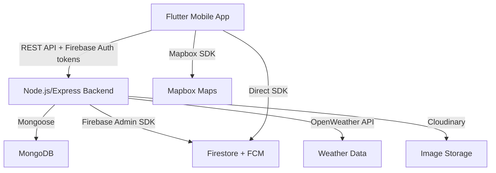

# Digital Kissan — Complete Project Analysis

## What Is This Project?

**Digital Kissan** is a **Flutter + Node.js agriculture mobile app** for Pakistani farmers. It provides weather forecasting, crop marketplace, real-time alerts, and bilingual support (English/Urdu).

---

## Architecture Overview

**Two-tier architecture:**
- **Frontend**: Flutter (Dart) — screens, providers, services
- **Backend**: Node.js/Express — REST API, MongoDB, Firestore, weather jobs

---

## Frontend Structure (`lib/`)

### Entry Point — `main.dart`
- Initializes Firebase, fetches Mapbox token from backend, sets up FCM notifications
- Wraps app in `MultiProvider` with 5 providers: `LanguageProvider`, `AuthProvider`, `PlantDiseaseProvider`, `NotificationService`, `AlertService`
- **Splash → Auth Check → Role-Based Routing**: If user is `admin` → `AdminConsoleShell`, else → `MainNavigationShell` (5-tab bottom nav)
- Bootstrap uses a `Completer` with 5-second timeout to avoid hanging if auth is slow

### Navigation (5 Tabs for Farmers)
| Tab | Screen | Purpose |
|-----|--------|---------|
| Home | `DashboardScreen` | Weather summary, location, tips carousel, alerts |
| Forecast | `ForecastScreen` | Multi-day weather forecast with hourly drill-down |
| Alerts | `AlertsScreen` | Weather alerts (rain, heat, cold, wind) |
| Market | `MarketScreen` | Crop rates, buy/sell listings, offers, orders, chat |
| Settings | `SettingsScreen` | Profile, language, notifications, logout |

### Admin Console (8 Tabs)
Overview, Users, Listings, Orders, Alerts, Notifications (broadcast), Rates, Ops (weather refresh, rate ingestion)

---

## Providers (State Management)

| Provider | Role |
|----------|------|
| `AuthProvider` | Listens to `FirebaseAuth.authStateChanges()`, creates Firestore user doc on sign-in, saves FCM token. Has explicit `AuthBootstrapState` enum (unknown/authenticated/unauthenticated) to prevent race conditions |
| `LanguageProvider` | Holds current `Locale` (en/ur), notifies UI for live language switching |
| `PlantDiseaseProvider` | **Currently disabled** — was TFLite-based plant disease classifier. Stubbed out because `tflite_flutter` requires Git |

---

## Services Layer

### `ApiClient` — Central HTTP Client
- Builds URLs from `AppConfig.apiBaseUrl` (compile-time `--dart-define`)
- Attaches Firebase ID tokens via `Authorization: Bearer <token>` for authenticated requests
- **Retry with exponential backoff** (via `RetryHelper`) — GET retries 3x, POST/PATCH/DELETE retry 2x
- Handles 401 (session expired), 429 (rate limit), file uploads with multipart/form-data
- 20-second timeout on all requests

### `AuthService` — Firebase Auth Wrapper
- Email/password registration & sign-in
- Password reset emails
- Email verification flow (send + reload to check `emailVerified`)

### `FirebaseService` — User Profile CRUD via Backend
- `createUserIfNotExists()` — PATCH `/api/users/me` then GET to ensure profile exists
- `updateUserProfile()`, `updateUserLocation()`, `updateUserNotificationData()` — all PATCH to `/api/users/me`
- `messagesStream()` — polling-based (every 10 seconds), not real-time WebSockets

### `WeatherService` — Weather Data
- Fetches from backend `/api/weather?lat=&lon=` or `/api/weather/me` (authenticated, uses saved location)
- Parses OpenWeather "current" and "forecast" JSON into `CurrentWeather`, `DailyForecast`, `HourlyForecast` model classes
- `_toDailyFromForecast()` — groups 3-hour forecast slices by date, aggregates min/max/avg temps, computes probability of precipitation using `1 - Π(1-pop_i)`

### `MarketApiService` — Marketplace Operations
- **DTOs**: `UserProfileDto`, `CropRateDto`, `ListingDto`, `OfferDto`, `OrderDto`
- **Listings**: CRUD at `/api/listings`, image upload at `/api/uploads/listing-image`
- **Offers**: create, accept, reject, cancel — full offer lifecycle
- **Orders**: fetch my orders, update status
- **Messaging**: send messages, fetch per-listing, mark read, typing indicators
- **Ratings**: rate users (1-5 stars + comment), fetch user ratings
- **Presence**: online/offline status, last seen

### `AlertService` — Weather Alerts
- Fetches alerts from `/api/alerts` (authenticated)
- `processWeather()` triggers alert reload from backend

### `NotificationService` — Local + FCM Notifications
- Initializes `FlutterLocalNotificationsPlugin` for Android/iOS
- Listens to `FirebaseMessaging.onMessage` for foreground FCM → shows local notification
- Respects user's notification preference from `SharedPreferences`

### `PushService` — FCM Token Management
- Singleton that registers/unregisters device tokens with backend
- Handles token refresh events

### `ConnectivityService` — Backend Health Check
- Singleton that pings `/api/health` with 5-second timeout
- Exposes `statusStream` for reactive connectivity state
- Dashboard uses this to show "Backend Unreachable" card with retry

---

## Utility Layer

| File | Purpose |
|------|---------|
| `cache_layer.dart` | Generic in-memory cache with TTL. `AppCaches` provides weather (10min), market (5min), userProfile (30min) instances |
| `retry_helper.dart` | Exponential backoff with jitter. `retry()` and `retryImmediate()` methods |
| `error_presenter.dart` | Converts exceptions (Firebase, network, HTTP status codes, upload, validation) to user-friendly messages |
| `form_validators.dart` | Validation for email, phone (7-15 digits), password (≥6 chars), name, crop name, district, quantity, price |
| `json_response.dart` | Safe JSON parsing: `asMap()`, `asMapList()`, `toStringOrEmpty()`, `toDoubleOrZero()`, `toDateTimeOrNow()`, `toStringListOrEmpty()` |

---

## Key Screens — Logic Deep Dive

### `LoginScreen`
1. Validates email format with regex, checks password not empty
2. Calls `AuthService.signInWithEmailPassword()` with 45s timeout
3. If email not verified → sends verification email → navigates to `EmailVerificationScreen`
4. If verified → calls `onLogin()` callback → navigates to `RoleBasedHomeScreen`
5. Uses `_hasNavigated` flag to prevent double-navigation

### `RegistrationScreen`
1. Collects name, email, phone (with country code dropdown, default +92 Pakistan), password + confirm
2. Uses `FormValidators` for all field validation
3. Step 1: Create Firebase account → Step 2: Save profile to backend (non-critical) → Step 3: Send verification email (non-critical) → Step 4: Navigate to verification screen
4. Each step has independent error handling — registration continues even if profile save or email send fails

### `DashboardScreen` (1048 lines — largest logic)
1. **On load**: checks backend health → loads user profile from backend → gets location (lat/lon/address) → fetches weather
2. **Location fallback chain**: backend profile → SharedPreferences cache → "No location set"
3. **Weather card**: shows temperature, icon (mapped from OpenWeather codes to Material icons), description, rain expectancy %, cloud coverage
4. **Tips carousel**: 5 agriculture tips auto-scrolling every 3 seconds with `PageController`, pauses on user interaction
5. **Alerts section**: processes weather data through `AlertService`, shows alert cards with type-specific icons
6. **Backend unreachable**: shows error card with retry button and ADB instructions

### `MarketScreen` (66K — the biggest file)
- **3 sub-tabs**: Rates, Listings, My Listings
- **Rates tab**: fetches crop rates, filter by crop/district
- **Listings tab**: browse all open listings, click for detail → `ListingDetailScreen` (offers, chat, seller profile, ratings)
- **My Listings tab**: CRUD your own listings with image upload, location picker, quality grade
- **Create Listing flow**: crop name, district, quantity, price, description, quality grade (A/B/C), images (via `ImagePicker` → upload to backend → Cloudinary), optional GPS location

### `ForecastScreen`
- Shows 5-day forecast from `WeatherService`
- Each day card shows: date, icon, max/min temp, rain probability, humidity
- Tap → `DetailedForecastScreen` with hourly breakdown, wind, UV, moon phase, visibility

### `LocationScreen`
- Uses `Mapbox` map with `geolocator` for current GPS position
- Reverse geocoding via `geocoding` package
- Saves selected location to backend AND `SharedPreferences` for offline fallback

### `ChatScreen`
- Per-listing messaging between buyer and seller
- Polls messages every 5 seconds
- Typing indicators via `/api/messages/typing`
- Unread count badges

---

## Backend Structure (`backend/src/`)

### Server Startup (`server.js`)
1. Connect to MongoDB
2. Initialize Firebase Admin SDK (from `serviceAccountKey.json`)
3. Start weather refresh cron job (every 15 minutes)
4. Start Express server on port 5000, bound to `0.0.0.0`

### Middleware Pipeline
- `helmet` — security headers
- `express-rate-limit` — 120 req/min per IP
- `cors` — configurable allowed origins
- `requireAuth` — verifies Firebase ID token. In dev, has `ALLOW_DEV_AUTH_FALLBACK` for mock user (fails startup in production)
- `attachDbUser` — loads/creates Firestore user document, attaches to `req.dbUser` with a `.save()` method
- `requireRole('admin')` — role-based access control

### Data Storage — Hybrid Approach
| Data | Storage | Why |
|------|---------|-----|
| Users, profiles, FCM tokens, weather cache, alerts | **Firestore** | Real-time sync, Firebase Auth integration |
| Listings, offers, orders, crop rates, ratings | **MongoDB** | Relational queries, aggregations, complex filters |
| Images | **Cloudinary** | CDN, image transformations |

### API Routes (13 route files)

| Route | Key Endpoints |
|-------|--------------|
| `/api/health` | GET — simple health check |
| `/api/users` | GET `/me`, PATCH `/me`, GET `/:uid`, POST `/me/fcm-token`, POST `/me/presence` |
| `/api/weather` | GET `/?lat=&lon=` (public), GET `/me` (auth, uses saved location) |
| `/api/listings` | GET (filter by crop/district/seller), POST (create), PATCH `/:id` (update), DELETE `/:id`, PATCH `/:id/status` |
| `/api/offers` | POST (make offer), GET `/me` (my offers), GET `/incoming` (offers on my listings), POST `/:id/accept`, `/:id/reject`, `/:id/cancel` |
| `/api/orders` | GET `/me`, PATCH `/:id/status` |
| `/api/rates` | GET `/latest`, POST `/ingest/official` |
| `/api/uploads` | POST `/listing-image` (multer + Cloudinary) |
| `/api/messages` | POST (send), GET `/listing/:id` (chat history), POST `/listing/:id/read`, POST `/typing` |
| `/api/ratings` | POST (rate user), GET `/:uid` (user ratings with stats) |
| `/api/alerts` | GET (user's weather alerts) |
| `/api/config` | GET `/public` (returns Mapbox token) |
| `/api/admin` | Overview stats, user/listing/order/alert management, weather refresh, rate ingestion, broadcast notifications |

### Weather Alerts Service (`weatherAlerts.service.js`) — Core Logic
1. **`fetchOpenWeather(lat, lon)`**: calls OpenWeather current + forecast APIs in parallel
2. **`toWeatherPayload()`**: normalizes raw API response into unified format
3. **`buildAlertDefinitions()`**: generates alerts based on thresholds:
   - Rain: pop ≥ 50% OR precipitation > 0.1mm
   - Heat: temp ≥ 35°C
   - Cold: temp ≤ 5°C  
   - Wind: speed ≥ 10 m/s
4. **`refreshWeatherForUser()`**: fetches weather → deduplicates alerts (max 1 per type per day) → saves to Firestore `weather_alerts` → sends FCM push → caches in `weather_cache`
5. **`startWeatherRefreshJob()`**: runs `refreshAllWeatherCaches()` every 15 minutes for all users with lat/lon set

### MongoDB Models
| Model | Key Fields |
|-------|-----------|
| `User` | firebaseUid (unique), name, phone, countryCode (+92), role (farmer/buyer/admin), district, province |
| `Listing` | sellerUid, cropName, qualityGrade, quantity, unit, askingPrice, district, lat/lon, imageUrls, status (open/reserved/sold/cancelled) |
| `Offer` | listingId (ref), buyerUid, offerPrice, quantity, status (pending/accepted/rejected/cancelled) |
| `Order` | listingId, offerId, buyerUid, sellerUid, finalPrice, quantity, unit, status (created→in_transit→delivered→completed/cancelled/disputed) |
| `CropRate` | cropName, marketName, district, minPrice, maxPrice, unit, sourceName, sourceUrl, rateDate |
| `Rating` | targetUid, raterUid, score (1-5), comment |

---

## Key Design Patterns

1. **DTO Pattern**: All API responses parsed through typed DTOs with safe JSON helpers
2. **Retry with Backoff**: All network calls use `RetryHelper` with exponential backoff + jitter
3. **Graceful Degradation**: Backend unreachable → show cached data from SharedPreferences
4. **Auth Bootstrap State Machine**: Prevents splash screen race conditions with explicit `unknown → authenticated/unauthenticated` transitions
5. **Role-Based Routing**: Admin users see completely different UI (admin console with 8 tabs)
6. **Hybrid Storage**: Firestore for real-time/auth-related data, MongoDB for marketplace domain data
7. **Background Weather Jobs**: Server-side cron refreshes weather for all users every 15 minutes, creates alerts, sends FCM pushes

## Localization
- English (`en`) and Urdu (`ur`) via Flutter's `intl` + generated `AppLocalizations`
- Language switchable from login screen and settings
- RTL text direction support for Urdu

## Security
- Firebase Auth tokens verified server-side via `firebase-admin`
- Rate limiting (120 req/min/IP)
- Helmet security headers
- Dev auth fallback **blocked in production** (throws on startup)
- Role-based access control for admin routes
